# ARL Autonomous Vehicle Control Track

**Autotronics Research Lab (ARL) — Ain Shams University**
*Course: Autonomous Vehicles & Drive-by-Wire Systems | Individual Project*

<p align="center">
  
</p>


## Contents

0. [Student information](#0-student-information)
1. [Project overview and status](#1-project-overview-and-status)
2. [System architecture](#2-system-architecture)
3. [Reproduction guide](#3-reproduction-guide)
4. [How each milestone was built](#4-how-each-milestone-was-built)
5. [Benchmark results](#5-benchmark-results)
6. [Critical comparison of the controllers](#6-critical-comparison-of-the-controllers)
7. [Why MPC tracks better than Pure Pursuit and Lateral PID](#7-why-mpc-tracks-better-than-pure-pursuit-and-lateral-pid)
8. [Known limitations and notes](#8-known-limitations-and-notes)
9. [Milestone 6: free exploration](#9-milestone-6-free-exploration)
10. [Repository structure](#10-repository-structure)
11. [References](#11-references)

---

## 0. Student information

| | |
|---|---|
| **Name** | Salma Khaled Shafek Shafek |
| **Repository** | https://github.com/SalmaShafek/Control_Project_ARL |
| **Video walkthrough** | https://drive.google.com/drive/folders/1BquYQReVJITlk9l02qz1mvBWxcq3mg_R?usp=sharing |
| **Submission date** | 9/10/2026 |

---

## 1. Project overview and status

This project builds the control system of a simulated self-driving car in ROS 2 (Humble). The car drives
around a closed racetrack and the goal is to keep it on the centerline, regulate its speed, and complete laps quickly and accurately.

The vehicle is modeled through a kinematic bicycle model that uses (x,y,yaw,v) as states and gives (delta, throttle) as inputs. 

| Milestone | Topic | Status | Main file |
|---|---|---|---|
| 1 | Discovery: ROS graph, topics, live plotting | Done | (command-line tools) |
| 2 | Extended kinematic bicycle model, forward Euler | Done | `bicycle_sim/bicycle_sim/bicycle_model.py` |
| 3 | Keyboard teleoperation bridge | Done | `bicycle_control/bicycle_control/teleop_bridge.py` |
| 4 | Longitudinal PID cruise control | Done | `bicycle_control/bicycle_control/longitudinal_pid.py` |
| 5.1 | Curvature-limited velocity profiler | Done | `bicycle_control/bicycle_control/velocity_profiler.py` |
| 5.2 | Lateral PID | Done | `bicycle_control/bicycle_control/lateral_pid.py` |
| 5.3 | Pure Pursuit | Done | `bicycle_control/bicycle_control/pure_pursuit.py` |
| 5.4 | Extended kinematic MPC | Done | `bicycle_control/bicycle_control/mpc.py` |
| 5.5 | Lap analyzer, telemetry, RViz dashboard | Done | `track_environment/track_environment/lap_analyzer.py` |
| 6 | Free exploration | Done | see [section 9](#9-milestone-6-free-exploration) |
| 7 | Documentation (this file) | Done | `README.md` |
| 8 | Video walkthrough | Done | link in section 0 |

---

## 2. System architecture

The repository contains three ROS 2 Python packages.

| Package | Responsibility |
|---|---|
| `bicycle_sim` | Vehicle model and simulator node (`sim_node`, ROS name `kinematic_bicycle`), URDF robot description, RViz configuration, launch file |
| `bicycle_control` | Teleoperation bridge, longitudinal PID, velocity profiler, Lateral PID, Pure Pursuit, MPC, and `controller_node` that runs the selected controller at 10 Hz |
| `track_environment` | Track loading, path publishing (`path_gen`), boundary cones, and the lap analyzer |


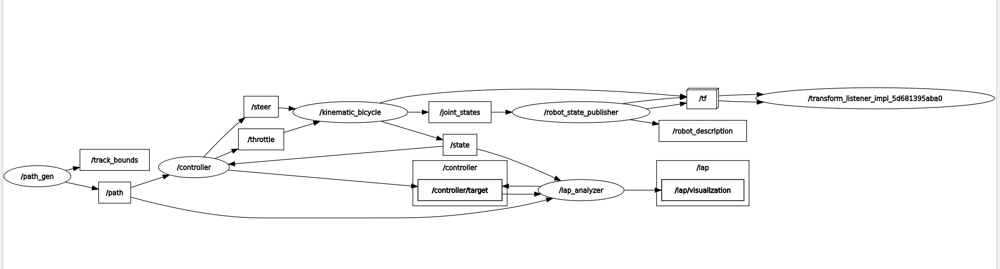

### Topics

| Topic | Type | Direction | Meaning |
|---|---|---|---|
| `/throttle` | `std_msgs/Float32` | controller → sim | normalised throttle (positive) and brake (negative), range [-1, 1] |
| `/steer` | `std_msgs/Float32` | controller → sim | front steering angle in rad, positive = left |
| `/state` | `nav_msgs/Odometry` | sim → all | pose, forward speed, yaw rate |
| `/path` | `nav_msgs/Path` | path_gen → all | centerline waypoints with yaw |
| `/cmd_vel` | `geometry_msgs/Twist` | keyboard → teleop_bridge | desired speed and turn rate |
| `/controller/target` | `geometry_msgs/PointStamped` | controller → analyzer | current look-ahead target (extra) |
| `/telemetry/cte`, `/telemetry/speed`, `/telemetry/heading_err_deg`, `/telemetry/lap_time` | `std_msgs/Float32` | analyzer → plotting tools | live signals |
| `/lap/metrics` | `std_msgs/String` (JSON) | analyzer → any | lap, lap times, speed, CTE, RMS CTE |
| `/lap/visualization` | `visualization_msgs/MarkerArray` | analyzer → RViz | gate, error whisker, HUD, BreadCrumbs, Target Point, Acceleration Guage |


### Vehicle parameters

| Parameter | Value |
|---|---|
| Wheelbase L | 1.25 m |
| Track width | 1.18 m |
| Wheel radius | 0.5 m |
| Maximum steering angle | 35° (0.6109 rad) |
| Powertrain gain k_a | 4.0 m/s² per unit throttle |
| Drag coefficient c_drag | 0.005 (multiplies v²) |
| Rolling resistance c_roll | 0.05 (multiplies v) |
| Maximum speed | 25 m/s |
| Simulation step Δt | 0.1 s |

---

## 3. Reproduction guide


### 3.1 Prerequisites and build

```bash
source /opt/ros/humble/setup.bash

sudo apt update && sudo apt install -y python3-colcon-common-extensions \
  python3-numpy python3-scipy python3-pytest ros-humble-robot-state-publisher \
  ros-humble-rviz2 ros-humble-xacro ros-humble-teleop-twist-keyboard \
  ros-humble-plotjuggler-ros ros-humble-rqt-plot

git clone https://github.com/SalmaShafek/Control_Project_ARL.git
cd Control_Project_ARL
colcon build --symlink-install
source install/setup.bash
```

In every new terminal, run the two source lines first:

```bash
source /opt/ros/humble/setup.bash
cd ~/Control_Project_ARL && source install/setup.bash
```

### 3.2 Launch modes

| Mode | Command | Milestone |
|---|---|---|
| Base simulation (command-line testing) | `ros2 launch bicycle_sim bicycle_sim.launch.py` | 1, 2 |
| Keyboard teleoperation | `ros2 launch bicycle_sim bicycle_sim.launch.py controller:=teleop` | 3 |
| Teleoperation with cruise control | `ros2 launch bicycle_sim bicycle_sim.launch.py controller:=teleop use_cruise_control:=true` | 4 |
| Lateral PID | `ros2 launch bicycle_sim bicycle_sim.launch.py controller:=lateral_pid` | 5.2 |
| Pure Pursuit | `ros2 launch bicycle_sim bicycle_sim.launch.py controller:=pure_pursuit` | 5.3 |
| Extended kinematic MPC | `ros2 launch bicycle_sim bicycle_sim.launch.py controller:=mpc` | 5.4 |

Keyboard driver for the teleoperation modes (second sourced terminal; click on it so it has focus):

```bash
ros2 run teleop_twist_keyboard teleop_twist_keyboard
```

Other launch options: `rviz:=false`, `analyzer:=false`

### 3.3 Inspecting the ROS graph

```bash
ros2 node list
ros2 topic list
ros2 topic info /state
ros2 interface show nav_msgs/msg/Odometry
ros2 topic echo /state
ros2 topic pub --once /throttle std_msgs/msg/Float32 "{data: 0.5}"
```

### 3.4 Live plotting

```bash
ros2 run rqt_plot rqt_plot /telemetry/cte /telemetry/speed
ros2 run plotjuggler plotjuggler      # Streaming -> ROS2 Topic Subscriber -> Start
```


## 4. How each milestone was built

This section explains, in plain language and with the key equations, how every component works and why it
was designed that way. The common structure is: **what it does**, **method**, **parameters**,
**problems met and how they were solved**, and **how it was verified**.

### 4.1 Milestone 1: discovery and live plotting

**What it does.** Identifies which nodes, topics and message types make up the simulation, and sets up live
plotting of signals.

**Method.** The ROS 2 command-line tools (`ros2 node list`, `ros2 topic list`, `ros2 topic info`,
`ros2 interface show`, `ros2 topic echo`) were used to find the two actuator inputs (`/throttle`,
`/steer`, both `std_msgs/Float32`) and the output `/state` (`nav_msgs/Odometry`). Speed is in m/s, steering
in radians (positive = left), and throttle is normalised to [-1, 1]. Live plots were built with `rqt_plot`
and PlotJuggler.

>
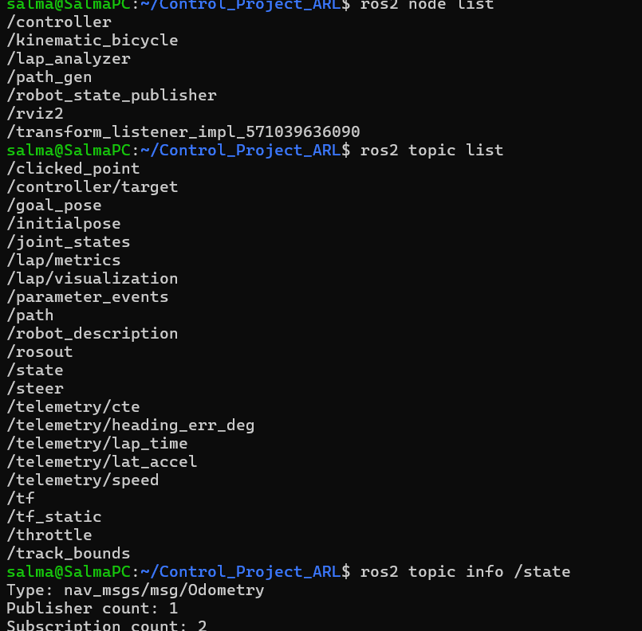 
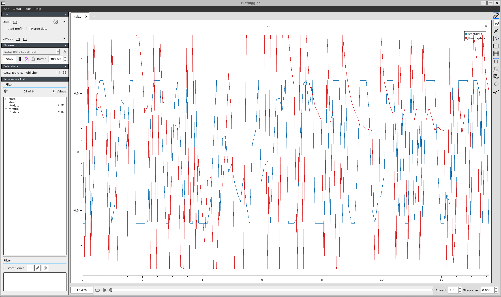 

### 4.2 Milestone 2: extended kinematic bicycle model

**What it does.** Defines how the car moves. The four wheels are merged into a front (steering) wheel and
a rear wheel separated by the wheelbase L, which gives the *bicycle model*. It is *kinematic* because it
only uses geometry (no tyre forces, so no slip), and *extended* because the speed v is a state driven by
throttle, drag and rolling resistance.

**Equations.** State x = [x, y, θ, v], inputs u = [throttle, δ]:

$$\dot x = v\cos\theta,\qquad \dot y = v\sin\theta,\qquad \dot\theta = \frac{v}{L}\tan\delta,\qquad
\dot v = k_a\,u_{thr} - c_{drag}\,v^2 - c_{roll}\,v$$

Forward Euler integration with Δt = 0.1 s: `state_next = state + state_dot * dt`. After each step the heading
is wrapped to [-π, π] with `atan2(sin θ, cos θ)`, and the speed is clamped to [0, v_max] (braking never
reverses the car).


**Verification** (VERIFY: keep only the checks you actually ran, with your own numbers). A throttle of 0.5 was sent and the speed was plotted; it rose smoothly and levelled off near 15.6 m/s as predicted. 

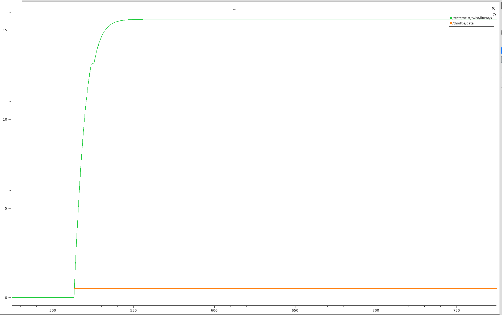

### 4.3 Milestone 3: keyboard teleoperation bridge

**What it does.** Translates the standard keyboard message (`geometry_msgs/Twist` on `/cmd_vel`) into the
car's own inputs, so the car can be driven by hand.

**Method (open-loop mapping).**

$$u_{thr} = \mathrm{clip}\!\left(\frac{v_{cmd}}{v_{max,lin}},\,-1,\,1\right),\qquad
\delta = \mathrm{clip}\!\left(\frac{\omega_{cmd}}{\omega_{max}}\,\delta_{max},\,-\delta_{max},\,\delta_{max}\right)$$

with v_max,lin = 5 m/s, ω_max = 1 rad/s and δ_max = 0.6109 rad. The result is published at 10 Hz. It is
*open loop*: the bridge never looks at the car's real speed, so the final speed depends on the physics.

**Safety watchdog.** If no Twist message has arrived for 0.5 s (key released, terminal closed, crash), both
outputs are set to zero. This stops the car from keeping its last command.


**Verification**  A fixed Twist (`linear.x = 2.5`, `angular.z = 0.5`) was published and the outputs were
checked: throttle 0.5 and steering 0.3054 rad. Stopping the publisher made both outputs drop to 0 within
about half a second, and very large inputs were clamped to 1.0 and 0.6109.

### 4.4 Milestone 4: longitudinal PID (cruise control)

**What it does.** Turns a *target speed* into a throttle command, so the car holds the requested speed
despite drag and rolling resistance. In teleoperation mode the keyboard's `linear.x` becomes the target.

**Method.** With error e = v_ref − v:

$$u = K_p\,e + K_i\!\int e\,dt - K_d\,\frac{dv}{dt}$$

The derivative acts on the *measured speed* (not on the error), so a sudden change of target does not create
a large spike. The output is clamped to [-1, 1]. Gains: K_p = 1.0, K_i = 0.2, K_d = 0.05 (Δt = 0.1 s).

**Anti-windup (the main design lesson).** My first version only limited the integral to a fixed range. The
test showed two faults (figure below, "before"): a 5 % overshoot with a slow tail, and a throttle stuck at
about -0.4 after the car had stopped, because the integral had piled up while the output was saturated at
full braking. The fix was *conditional integration*: the integral is not updated while the output is
saturated and the error would push it further into saturation, with a loose clamp kept only as a backstop.
VERIFY:  The "after" run shows no overshoot, a holding throttle of about 0.09 at 5 m/s (the physics predicts 0.094), and a throttle that returns to 0 after the stop.


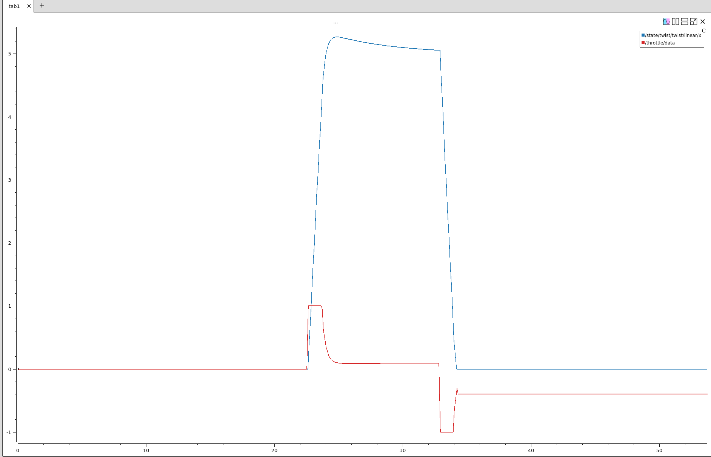 
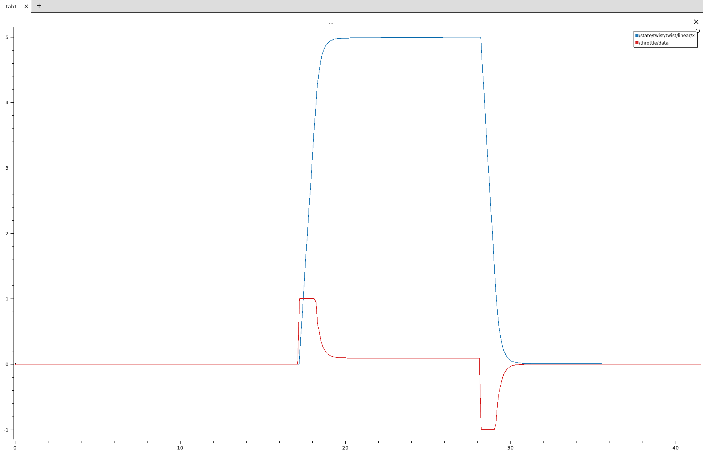

### 4.5 Milestone 5.1: velocity profiler

**What it does.** Chooses a target speed along the track so the car slows for corners and speeds up on
straights. The model has no tyre-grip limit, so without this the car could take a sharp corner at an
impossible sideways acceleration.

**Method.** Sideways acceleration in a bend is a_lat = v²κ, where κ is the path curvature (1 / radius).
Limiting it to a_lat,max gives the fastest allowed speed:

$$v_{ref} = \min\!\left(v_{max},\ \sqrt{\frac{a_{lat,max}}{|\kappa|}}\right)$$

with a_lat,max = 5 m/s² and v_max = 7.5 m/s. When |κ| is below 1e-6 the road is treated as straight and the
function returns v_max (avoids a division by zero). The absolute value is used so left and right bends are
treated the same (a first draft missed this and sent right-hand bends at full speed). Curvature is
estimated in `controller_node.py` from the change in waypoint yaw between the previous and next waypoints
divided by the distance between them. 

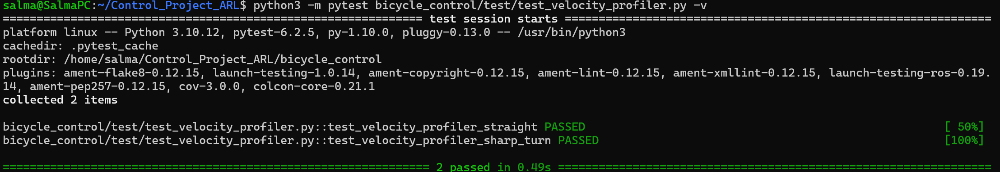

### 4.6 Milestone 5.2: Lateral PID

**What it does.** The simplest steering controller: it reacts to where the car is *now*.

**Inputs.** Cross-track error e_y (metres, positive when the car is left of the path) and heading error
e_ψ = ψ_vehicle − ψ_path (radians, wrapped).

**Method.** Steering is a PID on the cross-track error plus a separate proportional heading term:

$$\delta = -\Big(K_p\,e_y + K_i\!\int e_y\,dt + K_d\,\dot e_y\Big) - K_\psi\,e_\psi$$

The minus signs come from the sign convention: a car left of the path (e_y > 0) must steer right
(negative δ), and a car pointing left of the road (e_ψ > 0) must also steer right. Gains: K_p = 0.8,
K_i = 0.02, K_d = 0.15, K_ψ = 0.5; the output is clamped to ±35°.

**Design decisions:**
- Anti-windup is conditional integration, as in the speed controller.
- The first derivative sample is skipped (no previous value), which avoids a false spike at start-up.

**Limitation.** It has no preview of the road ahead: it begins steering only after the car has drifted.
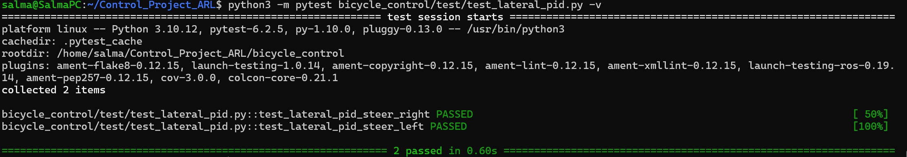

### 4.7 Milestone 5.3: Pure Pursuit

**What it does.** A geometric controller with *preview*: it picks a point on the path a short distance
ahead and steers along the circular arc that reaches it.

**Method.** 
1. **Adaptive look-ahead distance:** L_d = clip(k_v · v + L_min, L_min, L_max), with k_v = 0.25,
   L_min = 0.8 m and L_max = 2.5 m. A faster car looks further ahead, which keeps it stable at speed.
2. **Target waypoint:** the first waypoint at least L_d ahead of the nearest waypoint along the path.
3. **Coordinate transformation:** express the target in the vehicle frame and compute the angle α between
   the car's heading and the line to the target.
4. **Arc steering law:**

$$\delta = \arctan\!\left(\frac{2L\sin\alpha}{L_d}\right)$$

**Trade-off.** A short look-ahead reacts quickly but can oscillate; a long one is smooth but cuts corners.
Speed comes from the velocity profiler and the longitudinal PID.

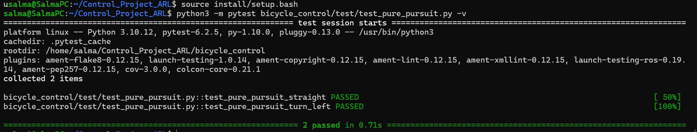


### 4.8 Milestone 5.4: Extended kinematic MPC

**What it does.** At every control step it *predicts* the next second of driving with the bicycle model,
searches for the steering and acceleration sequence with the lowest cost, applies only the first step, and
repeats (receding horizon).

**Decision variables.** u = [δ₀, a₀, δ₁, a₁, …, δ_{N−1}, a_{N−1}] with horizon N = 10 steps of Δt = 0.1 s.
Bounds: |δ| ≤ 0.6109 rad and |a| ≤ k_a = 4 m/s².

**Prediction model.** The same discrete model as Milestone 2, but with acceleration as the input:

$$x_{k+1} = x_k + v_k\cos\theta_k\,\Delta t,\quad y_{k+1} = y_k + v_k\sin\theta_k\,\Delta t,\quad
\theta_{k+1} = \theta_k + \frac{v_k}{L}\tan\delta_k\,\Delta t,\quad v_{k+1} = v_k + a_k\,\Delta t$$

**Cost in the Frenet (path-aligned) frame.** For every step the predicted pose is compared with the
reference pose (x_ref, y_ref, ψ_ref, v_ref) supplied by the controller node:

$$e_{lat} = -\sin\psi_{ref}\,(x-x_{ref}) + \cos\psi_{ref}\,(y-y_{ref}),\qquad
e_\psi = \mathrm{wrap}(\theta-\psi_{ref}),\qquad e_v = v - v_{ref}$$

$$J = \sum_{k=0}^{N-1}\Big( w_{lat}\,e_{lat}^2 + w_{\psi}\,e_\psi^2 + w_v\,e_v^2 + w_\delta\,\delta_k^2 +
w_{d\delta}\,(\delta_k-\delta_{k-1})^2 + w_a\,a_k^2 \Big)$$

Weights: w_lat = 30, w_ψ = 10, w_v = 1, w_δ = 0.2, w_dδ = 6, w_a = 0.1. The first three terms say what to
track, and the last three make the driving smooth (small steering, gentle steering changes, gentle
acceleration).

**Solver.** `scipy.optimize.minimize` with SLSQP (`maxiter` 25, `ftol` 1e-3), with the bounds above.
- **Warm start:** the previous solution, shifted forward by one step, is the starting guess. The plan
  changes little in 0.1 s, so this saves iterations. It is clipped to the bounds.
- **Safety:** a failed or non-finite result falls back to the warm start, and the outputs are clipped.
  Hitting the iteration limit is normal and the result is still used.
- **Output:** steering δ₀ and throttle = a₀ / k_a, clipped to [-1, 1]. 

**Reference construction (in `controller_node.py`).** The N reference points are placed along the path at
distances (k+1) · v · Δt ahead of the nearest waypoint. The reference speed is the constant target speed of
4 m/s, **not** the profiler's speed (see the note in section 9.2).

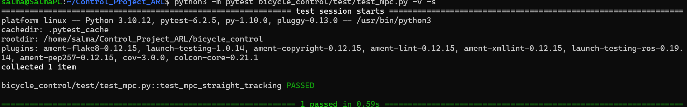


### 4.9 Milestone 5.5: lap analyzer, telemetry and RViz dashboard

**What it does.** A passive observer node. It never drives the car; it measures how well the controller does.

**Method.**
- **Cross-track error:** each `/state` message is projected onto the two path segments next to the nearest
  waypoint, giving the exact perpendicular distance (signed: positive = left) and the progress `s` along the
  track. Heading error is wrapped to [-π, π].
- **Lap timing:** a lap is counted when `s` jumps from the last quarter of the track to the first quarter
  while moving forward, and the crossing time is interpolated between two state messages.
- **Statistics per lap:** mean, maximum and RMS of |CTE| (RMS = √mean(e²), which weights large errors more),
  mean and maximum speed, and total distance. They are printed as a banner and the per-lap buffers are cleared.
- **Telemetry topics (10 Hz):** `/telemetry/cte`, `/telemetry/speed`, `/telemetry/heading_err_deg`,
  `/telemetry/lap_time`, and a JSON summary on `/lap/metrics`.
- **RViz markers (`/lap/visualization`):**
  - start/finish gate (provided),
  - **CTE whisker:** a line from the car to its projection on the path, green / yellow / red by the size
    of the error,
  - **HUD scoreboard:** floating text with lap, lap time, speed, CTE and best lap.
  - **Breadcrumb trail:** A breadcrumb trail of the last 400 positions coloured by speed (blue slow, red fast)
  - **Lateral-acceleration gauge:** A bar with a tick at the profiler's 5 m/s² limit; lateral acceleration is v times the yaw rate
  - **Look-ahead sphere:** A look-ahead sphere with a line from the car (the controller publishes its current target on `/controller/target`).


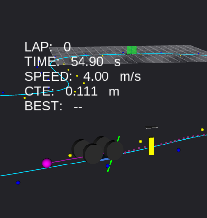
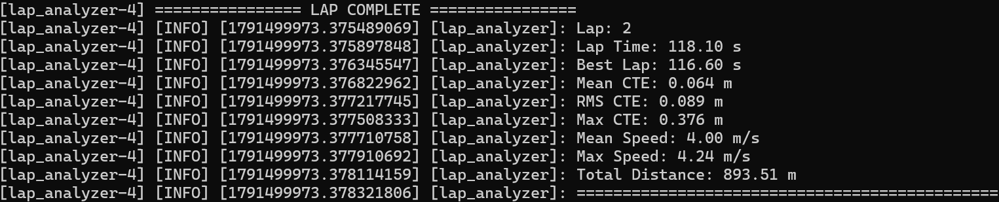


## 5. Benchmark results


## 5.1 Leaderboard (All Four Laps per Controller)

| Controller Mode | Best Lap Time (s) | Top Speed (m/s) | Mean CTE (m) | Max CTE (m) | RMS CTE (m) | Mean Speed (m/s) | Total Distance (m) | Laps Completed / Status |
|---|---:|---:|---:|---:|---:|---:|---:|---|
| **Manual Teleoperation** | 385.00 | 4.38 | 0.816 | 1.600 | 1.493 | 0.854 | 1785.30 | 2/4 - not Complete* |
| **Lateral PID (Reactive)** | 78.90 | 7.75 | 0.470 | 4.621 | 0.696 | 6.44 | 1984.07 | 4/4 - Complete |
| **Pure Pursuit (Preview)** | 68.91 | 7.65 | 0.046 | 0.368 | 0.068 | 6.60 | 1781.90 | 4/4 - Complete |
| **Extended Kinematic MPC (Optimal)** | 115.92 | 4.25 | 0.064 | 0.376 | 0.089 | 4.00 | 1787.15 | 4/4 - Complete |

### Aggregation Method

- **Best Lap Time:** Minimum of the four lap times.
- **Top Speed:** Maximum of the four per-lap maximum speeds.
- **Mean CTE:** Average of the four per-lap mean CTE values.
- **Max CTE:** Maximum of the four per-lap maximum CTE values.
- **RMS CTE:** Square root of the average of the four squared per-lap RMS CTE values.
- **Mean Speed:** Average of the four per-lap mean speed values.
- **Total Distance:** Sum of the four individual lap distances.
- **Laps Completed / Status:** Number of completed laps out of four and the run status.

*The manual teleoperation was very complcated to execute using the keyboard so I only got 2 complete laps

## 5.2 Per-Lap Results

### Lateral PID (Reactive)

| Lap | Lap Time (s) | Best Lap (s) | Mean CTE (m) | RMS CTE (m) | Max CTE (m) | Mean Speed (m/s) | Max Speed (m/s) | Lap Distance (m) |
|---|---:|---:|---:|---:|---:|---:|---:|---:|
| 1 | 80.65 | 80.65 | 0.385 | 0.536 | 2.054 | 6.31 | 7.75 | 487.20 |
| 2 | 79.45 | 79.45 | 0.509 | 0.795 | 4.453 | 6.46 | 7.70 | 497.59 |
| 3 | 78.90 | 78.90 | 0.487 | 0.749 | 4.621 | 6.52 | 7.68 | 499.52 |
| 4 | 80.40 | 78.90 | 0.498 | 0.678 | 2.478 | 6.48 | 7.68 | 499.76 |

### Pure Pursuit (Preview)

| Lap | Lap Time (s) | Best Lap (s) | Mean CTE (m) | RMS CTE (m) | Max CTE (m) | Mean Speed (m/s) | Max Speed (m/s) | Lap Distance (m) |
|---|---:|---:|---:|---:|---:|---:|---:|---:|
| 1 | 71.46 | 71.46 | 0.047 | 0.070 | 0.335 | 6.42 | 7.65 | 445.65 |
| 2 | 69.50 | 69.50 | 0.044 | 0.064 | 0.281 | 6.63 | 7.64 | 445.40 |
| 3 | 68.98 | 68.98 | 0.044 | 0.066 | 0.368 | 6.67 | 7.65 | 445.52 |
| 4 | 68.91 | 68.91 | 0.047 | 0.070 | 0.345 | 6.68 | 7.65 | 445.33 |

### Extended Kinematic MPC (Optimal)

| Lap | Lap Time (s) | Best Lap (s) | Mean CTE (m) | RMS CTE (m) | Max CTE (m) | Mean Speed (m/s) | Max Speed (m/s) | Lap Distance (m) |
|---|---:|---:|---:|---:|---:|---:|---:|---:|
| 1 | 116.90 | 116.90 | 0.063 | 0.087 | 0.361 | 3.98 | 4.25 | 446.50 |
| 2 | 116.40 | 116.40 | 0.067 | 0.093 | 0.376 | 4.01 | 4.20 | 446.96 |
| 3 | 117.78 | 116.40 | 0.063 | 0.088 | 0.322 | 4.01 | 4.25 | 447.08 |
| 4 | 115.92 | 115.92 | 0.063 | 0.088 | 0.374 | 4.01 | 4.25 | 446.61 |


### Manual Teleoperation

| Lap | Lap Time (s) | Best Lap (s) | Mean CTE (m) | RMS CTE (m) | Max CTE (m) | Mean Speed (m/s) | Max Speed (m/s) | Lap Distance (m) |
|---|---:|---:|---:|---:|---:|---:|---:|---:|
| 1 | 400.69 | 400.69 | 0.834 | 1.530 | 1.600 | 0.834 | 4.33 | 450.30 |
| 2 | 385.00 | 385.00 | 0.800 | 1.460 | 1.530 | 0.870 | 4.38 | 445.00 |


## 6. Critical comparison of the controllers

### 6.1 Design comparison

| | Lateral PID | Pure Pursuit | MPC |
|---|---|---|---|
| Information used | cross-track and heading error now | one look-ahead point | N predicted steps of reference |
| Preview of the road | none | one point | whole horizon |
| Uses a vehicle model | no | geometry only | yes (the bicycle model) |
| Handles actuator limits | clips afterwards | clips afterwards | inside the optimisation |
| Main tuning knobs | K_p, K_i, K_d, K_ψ | look-ahead (k_v, L_min, L_max) | cost weights, horizon |
| Computation per step | negligible | negligible | 2 to 40 ms (SLSQP) |
| Typical failure | cuts or swings wide in corners | cuts corners if look-ahead too long, oscillates if too short | sensitive to model error, delay and bad reference data |

### 6.2 What the measurements show


### Controller Performance Discussion

**Note:** Manual teleoperation is excluded because its results are affected by human error and reaction time.

- **Tracking accuracy:** Pure Pursuit performed best, with a mean CTE of **0.046 m**, RMS CTE of **0.068 m**, and max CTE of **0.368 m**. Compared with Lateral PID, it reduced these errors by 0.424 m, 0.628 m, and 4.253 m, respectively.

- **Lap time and speed:** Pure Pursuit had the fastest best lap (**68.91 s**), followed by Lateral PID (**78.90 s**) and MPC (**115.92 s**). Lateral PID reached the highest top speed (**7.75 m/s**), followed by Pure Pursuit (**7.65 m/s**) and MPC (**4.25 m/s**). Lap times are not directly comparable because MPC used a constant 4 m/s reference, while the other controllers used the curvature profiler.

- **Corners and straights:** Lateral PID had the largest tracking deviation (max CTE **4.621 m**), suggesting difficulty in sharper corners. Pure Pursuit and MPC maintained lower errors. Use the RViz whisker visualization and CTE plot to identify the exact locations of the largest deviations.

- **Smoothness:** Pure Pursuit maintained accurate tracking with low CTE. Lateral PID showed larger deviations, potentially requiring stronger corrections. Check the steering plots for visible weaving and consider the MPC behaviour noted in Section 8.1.

- **Comparison with theory (Section 8):** Results generally support the theory that preview improves path tracking. Pure Pursuit performed best overall, while MPC did not outperform it despite its optimization-based design. Possible reasons include the constant speed reference and waypoint ordering.

---

## 7. Why MPC tracks better than Pure Pursuit and Lateral PID

All three controllers solve the same problem, but they use different amounts of information about the future.

**Lateral PID is purely reactive.** It sees the error that has already happened. In a bend the path starts
turning before the car does, so an error must build up before the controller acts, and the controller is
always one step behind the road. Raising the gains reduces this lag but makes the loop oscillate, because
the controller has no knowledge of how the car responds to steering.

**Pure Pursuit has preview, but only one point and no dynamics.** Steering toward a point L_d ahead lets it
start turning earlier, which is why it cuts a smooth arc. But it assumes the car can follow the arc to that
point immediately, and a single look-ahead distance has to serve every speed and every curvature: a long
look-ahead is smooth but cuts corners, and a short one tracks closely but oscillates. It also gives no way to
trade accuracy against smoothness, or to respect limits beyond clipping the final angle.

**MPC optimises over the whole horizon with a model.** It predicts where each candidate sequence of steering
and acceleration commands will take the car, using the same equations as the vehicle, and compares them with
the next N reference points. This gives three advantages:

1. **Preview of the whole road ahead.** It starts steering at the right moment for an upcoming bend, and it
   can trade a small error now for a smaller error later.
2. **A model of the vehicle.** It knows that a given steering angle turns the car at a rate proportional to
   v / L, so the effect of speed is built in, not tuned away with one set of gains.
3. **Constraints and explicit trade-offs.** Steering and acceleration limits are inside the optimisation, so
   it plans around them instead of hitting them by accident, and the weights state exactly how much tracking
   error is worth against steering effort and steering smoothness.

The price is computation (an optimisation every 0.1 s), a dependence on the model being close to the real
vehicle, and a sensitivity to the quality of the reference it is given. These are the reasons the measured
results in section 6 can differ from the theory, as discussed in section 9.

---

## 8. Known limitations and notes

### 8.1 Out-of-order waypoints in `centerline_0.csv`

**Observation.** The MPC moved slightly left and right on the straights of the official track, but not in
the corners (screenshot below). I tried solving it by changine the weights of cost function increasing the steering rate. I clamped the steering rate as well but it did not work. So, I started thinking it is the file itself anf gave it to Claude AI to diagnose whether that is the problem or not.
**Diagnosis.** A check of the track file (`tools/check_track.py`) shows that the waypoints are not strictly
in driving order: about 16 % of the segments point backwards relative to the local direction of travel. The
loader computes each waypoint's yaw from the direction to the *next* point, so these points carry a yaw that
is roughly 180° wrong. All three controllers use the waypoint yaw (heading error, curvature estimate, MPC
reference), so they all receive this noise.
Claude provided a clean csv file which it filtered and when tested: the wobbles disappeared.

**Test.** The same MPC, with the same weights, on the cleaned track showed **no oscillation on the
straights**. So the data, and not the controller, caused it.

The Original File
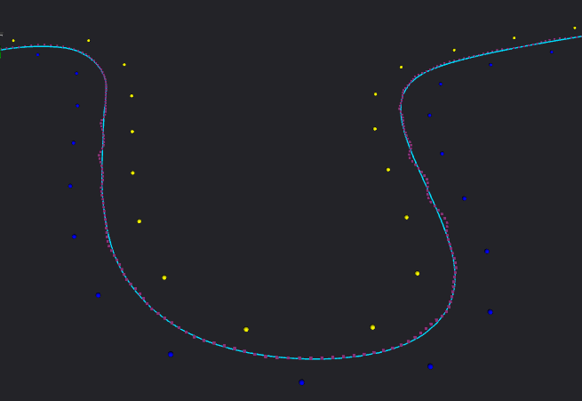

The Modefied File
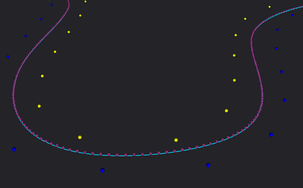

**Side Note.** The official file was kept for the benchmark, so the controllers are compared under identical
conditions; the absolute CTE and lap-time values include this data noise. A preprocessing step (re-ordering
and smoothing the waypoints before they reach the controllers) would be the natural fix, and
`centerline_clean.csv` is provided as a demonstration (ros2 launch bicycle_sim bicycle_sim.launch.py controller:=mpc track_file:=centerline_clean.csv).

### 8.2 Speed reference differs between the controllers

Lateral PID and Pure Pursuit take their target speed from the curvature profiler (4 m/s base, up to 7.5 m/s
on straights, slower in bends). The MPC mode in `controller_node.py` uses a **constant 4 m/s** reference for
every predicted step and lets the MPC's own acceleration input track it; the profiler and the longitudinal
PID are not used in that mode. Consequently the lap times and top speeds of MPC are not directly comparable
with the other two, and CTE is also affected because it depends on speed. A fairer comparison would feed the
profiler's speed into the MPC reference, which is listed as possible future work.

### 8.3 Model limitations

- The kinematic model has no tyre slip and no grip limit, so the car can turn at lateral accelerations a real
  car could not hold.


---

## 9. Milestone 6: free exploration

1. **Kinematics vs multi-body.** This simulator uses the kinematic bicycle model, which works on one steering aangle δ, with tan δ = L/R. A real four-wheel car cannot do this because in the real world the inner tire will take a smaller radius than the outer one during turning or they may slip, wear out etc. Both wheels must be perpendicular to their lines to the turn’s center, so they need different angles:The Ackermann version computes separate left and right steering angles from the commanded turning radius, using the same formulas as above. 


tan δ_inner = L / (R − W/2)
tan δ_outer = L / (R + W/2)

In ros2_control, the steering controllers library only produces inverse kinematics: tell it you want to move in a certain way and it translates that to the motor. It gives steering posion for each joint and a velocity for each traction joint. Since it cannot do path tracking, other controllers like MPC, Pure Pursuit can take its inputs and translate them to Twist.

2. **2D vs 3D simulation.** A 2D sim assumes that there is no slip in the wheels, so it is relatively easy to compute and model.
3D sims add another layer which is the actual physics surrounding the car. Gazebo for example can model tire grip using (the Pacejka Magic Formula), suspension, load transfer, terrain, and sensor noise.

|                     | 2D kinematic (mine)  | 3D physics (Gazebo / MVSim)                                          |
|---------------------|----------------------|----------------------------------------------------------------------|
| Compute             | Very light           | Heavier                                                              |
| Setup               | A few Python files   | Robot models, world files, bridge config, environment variables, optionally Docker |
| High-speed accuracy | Poor (no slip)       | Much better                                                          |
| Sensors and obstacles | Not modeled        | Modeled                                                              |
| Iteration speed     | Fast                 | Slower                                                               |
| Sim-to-real transfer | Weaker              | Stronger, but a gap remains                                          |

MVsim is lighter than Gazebo, but still simulates 3D. 
Takeaway. A controller tuned in my 2D sim may behave differently on a real car, because the real car slides where my model doesn’t. The 2D sim is best for quick controller comparison, and 3D engines are best when perception, terrain, or high-speed dynamics matter.

3. **Deterministic vs sampling-based control.** (Deep dive into mppi in milestone 6 notes.)
Deterministic (MPC): solves for 1 optimized solution only.
sampling-based control (MPPI): Solves for multiple random ideas then finds the best of them.

| Aspect | MPC | Nav2 MPPI |
|---|---|---|
| Method | Solves a constrained optimization problem each step, typically with a gradient-based solver | Samples thousands of random control sequences, simulates each, and averages them using cost-based (path-integral) weights |
| Model and cost | Needs a smooth, differentiable setup | Handles non-linear models and non-differentiable costs |
| Obstacles | Awkward to encode, since obstacles make the problem non-convex | Natural: the cost map penalizes trajectories that hit obstacles |
| Constraints | Explicit and handled well | Usually handled as cost penalties |
| Compute | Moderate (one solver run per step) | Heavy, but parallelizes well (GPU or multi-core CPU) |
| Behavior | Deterministic and smooth | Stochastic, with more flexibility |


## 10. Repository structure

```text
Control_Project_ARL/
├── README.md
├── assets/                      figures and the demo GIF
├── results/                     benchmark logs (lateral_pid.log, pure_pursuit.log, mpc.log, teleop.log)
├── tools/
│   ├── check_track.py           waypoint-ordering check
│   └── parse_laps.py            lap banners -> markdown tables
├── bicycle_sim/                 simulator, URDF, RViz config, launch file
│   └── bicycle_sim/bicycle_model.py
├── bicycle_control/
│   ├── bicycle_control/         controller_node, teleop_bridge, longitudinal_pid, velocity_profiler,
│   │                            lateral_pid, pure_pursuit, mpc
│   └── test/                    unit tests
└── track_environment/
    ├── tracks/                  centerline_0.csv, centerline_clean.csv, random_track0.csv (cones)
    ├── track_environment/       track loader, path_gen, lap_analyzer
    └── test/
```

---

## 11. References

- SciPy `scipy.optimize.minimize`, SLSQP method: https://docs.scipy.org/doc/scipy/reference/optimize.minimize-slsqp.html
- Milestone 6 resources from the project description: ROS 2 Control mobile-robot kinematics guide
  (https://control.ros.org/humble/doc/ros2_controllers/doc/mobile_robot_kinematics.html), the steering
  controllers library (https://control.ros.org/kilted/doc/ros2_controllers/steering_controllers_library/doc/userdoc.html)
- https://www.youtube.com/watch?v=19QLyMuQ_BE&t=150s
- https://www.mathworks.com/help/robotics/ug/local-path-planning-using-model-predictive-path-integral.html

